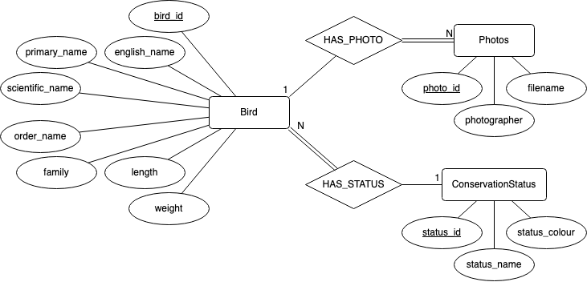
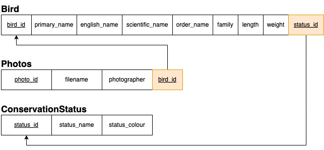

# Birds of Aotearoa v2

A website to explore and learn about various bird species in New Zealand. 

## Table of Contents

1. [Description](#description)
2. [Prerequisites](#prerequisites)
3. [Installation](#installation)
4. [Database Setup](#database-setup)
5. [Running the Application](#running-the-application)
6. [New Features](#new-features)
7. [Database Design](#database-design)
8. [Path Routing](#path-routing)
9. [EJS Server Side Rendering](#ejs-for-server-side-rendering-ssr)
10. [License](#license)
11. [Acknowledgements](#acknowledgements)
12. [Contact Information](#contact-information)


## Description

Birds of Aotearoa v2 is a back-end web application that provides information on different bird species found in New Zealand. This version is a extension of version 1 but it has an Express Server for path routing, EJS for server-side rendering and has a SQL database so we can manually manipulate the bird data by using CRUD operations. 

## Prerequisites

- Node.js
- npm
- MySQL
- Homebrew (for macOS users)

## Installation

1. Clone the repository:
    ```
    git clone https://github.com/anthonyzhdong/nzbirds.git
    cd nzbirds/v2
    ```
2. Install dependencies:
    ```
    npm install
    ```

3. Setup MySQL Using Homebrew (macOS users)
    ```
    brew update
    brew install mysql
    brew services start mysql
    ```

## Database Setup

1. Start MySQL:
    ```
    mysql -u root
    ```

2. Create the database by running the db_setup.sql file in the sql folder:
    (or code provided below)

    ```
    -- create database
    DROP TABLE IF EXISTS Photos;
    DROP TABLE IF EXISTS Bird;
    DROP TABLE IF EXISTS ConservationStatus;
    DROP DATABASE ASGN2;

    CREATE DATABASE ASGN2;
    USE ASGN2;

    -- create tables

    CREATE TABLE ConservationStatus (
        status_id INT NOT NULL AUTO_INCREMENT PRIMARY KEY,
        status_name VARCHAR(255) NOT NULL,
        status_colour CHAR(7) NOT NULL
    );

    CREATE TABLE Bird(
        bird_id INT NOT NULL AUTO_INCREMENT PRIMARY KEY,
        primary_name VARCHAR(255) NOT NULL,
        english_name VARCHAR(255) NOT NULL,
        scientific_name VARCHAR(255) NOT NULL,
        order_name VARCHAR(255) NOT NULL,
        family VARCHAR(255) NOT NULL,
        weight INT NOT NULL,
        length INT NOT NULL,
        status_id INT NOT NULL,
        CONSTRAINT fk_status_id FOREIGN KEY (status_id) REFERENCES ConservationStatus(status_id)
    );

    CREATE TABLE Photos(
        bird_id INT NOT NULL,
        filename VARCHAR(255) NOT NULL,
        photographer VARCHAR(255) NOT NULL,
        CONSTRAINT fk_bird_id FOREIGN KEY (bird_id) REFERENCES Bird(bird_id)
    );
    ```

3. Populate the database by running the db_setup.sql file in the sql folder.

## Running the Application

1. Start the Application:
    ```
    npm run start
    ```

2. Access the Application:
    
    Open your browser and navigate to http://localhost:3000

## New Features

- Create a bird profile by filling out the necessary details to add a new bird into the database
- Dynamic profiling editing allowing the user to manually update and modify the birds details in real-time.
- Delete a bird from the database with ease
- Extended functionality which allows a user to view the birds detail at greater size.

## Database Design

Below is an entity relationship diagram the back-end should use:



Here is the corresponding data model:



## Path Routing

The routes (endpoints) to specific pages

| Method | Route (endpoint)  | Response (action)                        |
|--------|-------------------|------------------------------------------|
| GET    | /                 | The home page (all birds)                |
| GET    | /birds/           | The home page (all birds)                |
| GET    | /birds/create     | A page with a form to create a bird      |
| GET    | /birds/:id        | A page for the bird with specified id    |
| GET    | /birds/:id/update | A page with a form to update bird        |
|        | INVALID           | A 404 "page not found"                   |

The routes (endpoints) to modify the database and upload images

| Method | Route (endpoint)  | Response (action)                                    |
|--------|-------------------|------------------------------------------------------|
| GET    | /birds/:id/delete | Modify the database, then redirect to the home page  |
| POST   | /birds/create     | Modify the database, then redirect to the home page  |
| POST   | /birds/edit       | Modify the database, then redirect to the home page  |

## EJS for Server-Side Rendering (SSR)

I used EJS for server-side rendering to dynamically generate HTML content based on the bird data stored in the database. EJS was chosen for its simplicity and seamless integration with Express, allowing for efficient rendering of dynamic content and improved SEO, which enhances user experience by delivering fully rendered HTML to users.

## License

MIT License

Copyright (c) 2024 Anthony Dong

Permission is hereby granted, free of charge, to any person obtaining a copy
of this software and associated documentation files (the "Software"), to deal
in the Software without restriction, including without limitation the rights
to use, copy, modify, merge, publish, distribute, sublicense, and/or sell
copies of the Software, and to permit persons to whom the Software is
furnished to do so, subject to the following conditions:

The above copyright notice and this permission notice shall be included in all
copies or substantial portions of the Software.

THE SOFTWARE IS PROVIDED "AS IS", WITHOUT WARRANTY OF ANY KIND, EXPRESS OR
IMPLIED, INCLUDING BUT NOT LIMITED TO THE WARRANTIES OF MERCHANTABILITY,
FITNESS FOR A PARTICULAR PURPOSE AND NONINFRINGEMENT. IN NO EVENT SHALL THE
AUTHORS OR COPYRIGHT HOLDERS BE LIABLE FOR ANY CLAIM, DAMAGES OR OTHER
LIABILITY, WHETHER IN AN ACTION OF CONTRACT, TORT OR OTHERWISE, ARISING FROM,
OUT OF OR IN CONNECTION WITH THE SOFTWARE OR THE USE OR OTHER DEALINGS IN THE
SOFTWARE.


## Acknowledgements

- Data licensed from [Birds New Zealand](https://www.birdsnz.org.nz/) for educational use within the University of Otago.
- Conservation status information from the [DOC website](https://www.doc.govt.nz/nature/conservation-status/).
- Images provided by individual bird photographers all across New Zealand.


## Contact Information

For any questions or inquiries, please contact Anthony Dong at [anthonyzhdong@gmail.com](mailto:anthonyzhdong@gmail.com).


